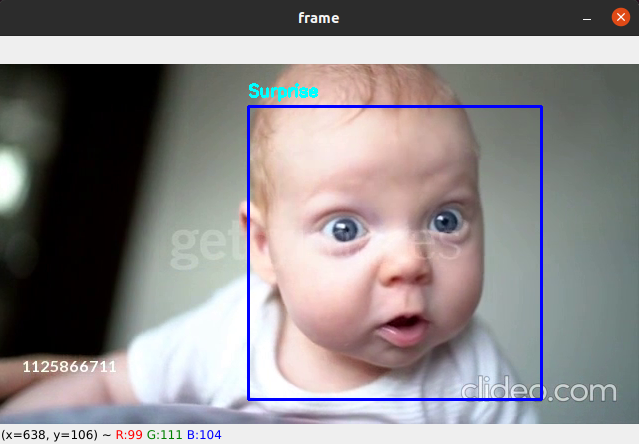

# Facial Expression Detection In Videos

The project is to detect the facial expression of a person in a video. The main script draws the rectangle around the face of a person and detect the mood/expression of the person using facial expression of that person.

The **Open-CV** module is used to draw and detect the position of the face of a person. The **Open-CV** module provides a *`haarcascade_frontalface_default.xml`* file which is used to detect the position of the face of a person in an image or in a video also.

I used simple **CNN with Pooling & Dense Layers** model to detect the expression of a person. The model is trained using the labeled data provided in the given [link](https://www.kaggle.com/c/challenges-in-representation-learning-facial-expression-recognition-challenge/data). The **training accuracy** of the model is **68%** and the **test/val accuracy** of the model is **63%**.

The script will use **Open-CV** module to read a video file and predict the expression of person. Some glimpse of the model working is as follows:



The required module to run the script is given in `requirements.txt` file. You can install the module by running the command in the CLI and run the script easily. The command to install required modules are as follows:(first install the vitualenv)

```
pip install virtualenv
virtualenv .env
# You can change the environment name
source .env/bin/activate        # For ubuntu users only
# go to the folder which contains the 'main.py' file.
python3 main.py
```

Thank you

-- The end --
